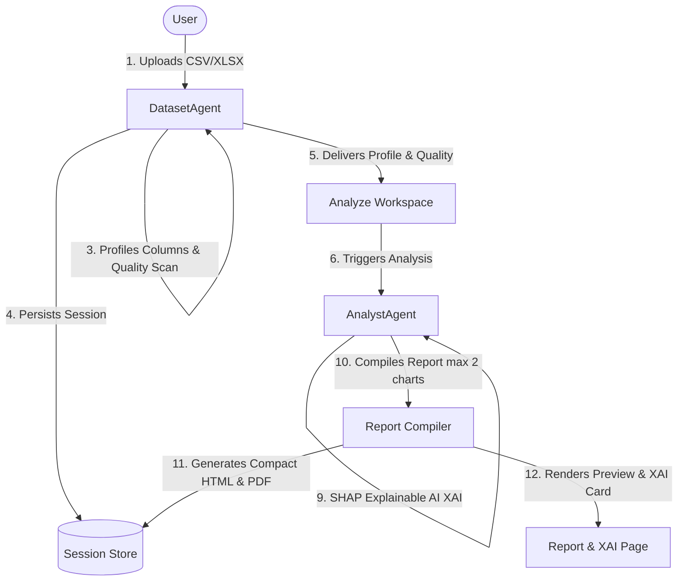

# DataVerse AI Data Scientist Backend (MVP)

DataVerse AI is a clean, production-ready MVP for an AI Data Scientist backend using FastAPI. It parses datasets (CSV/XLSX), validates columns, normalizes headers, computes business metrics deterministically using Pandas/scikit-learn, and produces a professional data report.

The LLM is optional and only used to polish the narration of computed facts. All calculations are deterministic.

## Two-Agent Architecture

The MVP relies on exactly two agents with a clear division of labor:



### Division of Labor

1. **`DatasetAgent`** (`app/agents/dataset_agent.py`):
   - Validates uploaded file limits and file formats.
   - Parses CSV/XLSX safely.
   - Normalizes columns (headers are cleaned and whitespace is removed).
   - Generates a unique `session_id`.
   - Stores the dataset locally in the filesystem session store.
   - Produces a dataset profile and data quality summary.
2. **`AnalystAgent`** (`app/agents/analyst_agent.py`):
   - Understands user semantic queries.
   - Maps columns semantically (e.g. mapping date, products, revenue).
   - Computes business metrics, EDA, trends, correlations, and outlier flags using Pandas.
   - Triggers predictive machine learning (Ridge or RandomForest) only if the dataset has at least **30 rows** (`MIN_ROWS_FOR_PREDICTION`) and a target is provided.
   - Runs XAI (Shapley/Feature Importance) upon successful modeling.
   - Generates charts-ready JSON and final polished report narration (using offline deterministic narration if LLM keys are absent).

---

## Unique Capabilities

Beyond the verifiable-analyst core (provenance receipts, reproducibility certificate,
verified what-if, quality doctor), DataVerse AI ships three capabilities no comparable
tool combines:

1. **Root-Cause Investigator** — ask *"Why did revenue drop in May?"* and the system runs
   a deterministic multi-step investigation: it locates the period delta, decomposes the
   change across every dimension (product / category / region / customer), ranks drivers
   by contribution ("Widget explains 100% of the drop"), and splits the change into price
   vs volume effects. Every step carries a provenance receipt. Works fully offline.
   (`app/services/root_cause.py`, `POST /api/sessions/{sid}/datasets/{did}/investigate`)
2. **Counterfactual XAI** — for each explained prediction, a deterministic single-feature
   search finds the smallest change that flips the outcome: *"Raising `quantity` from 8
   to 9.2 (+15%) would flip the predicted label from 'low' to 'high'."* Goes beyond SHAP
   importance to actionable, reproducible explanations. (`app/services/counterfactual.py`)
3. **Agentic chat loop** — when an LLM key is configured, chat answers come from a real
   plan→act→observe agent: the LLM chooses deterministic tools (KPIs, segments, trends,
   what-if, root-cause, prediction/XAI, quality), reads the computed observations, and
   answers using only those numbers. The full tool trace streams live into the UI. With
   no key, it falls back to the deterministic answer path. (`app/services/agent_loop.py`)

All three preserve the core guarantee: **every number is computed in pandas/scikit-learn;
the LLM only plans and phrases.**

---

## Simple Setup

### 1. Configure Environment
Create a local `.env` file inside the `dataverse_backend` folder:
```powershell
copy dataverse_backend\.env.example dataverse_backend\.env
```

### 2. Install MVP Requirements
Ensure your virtual environment is active, then install the lightweight MVP dependencies:
```powershell
.\.venv\Scripts\python -m pip install -r dataverse_backend/requirements-mvp.txt
```

### 3. Run Backend Server
Start the FastAPI server from the `dataverse_backend` directory:
```powershell
cd dataverse_backend
python -m uvicorn app.main:app --reload --host 127.0.0.1 --port 8000
```
Or run directly from the workspace root directory:
```powershell
python -m uvicorn app.main:app --reload --app-dir dataverse_backend --host 127.0.0.1 --port 8000
```

---

## API Endpoints

The frontend uses the session-based API flow:
- `GET /health/live` - backend liveness check.
- `GET /api/health` - API health check.
- `POST /api/sessions` - create a chat session.
- `POST /api/sessions/{session_id}/datasets/upload?auto_analyze=true` - upload a dataset into the session.
- `POST /api/sessions/{session_id}/analyze` - run full analysis for a session dataset.
- `POST /api/sessions/{session_id}/messages` - ask follow-up questions using `content` and `dataset_id`.
- `GET /api/sessions/{session_id}` - load messages, datasets, agent runs, and reports.
- `GET /api/datasets` - list recent datasets for the current workspace.

---

## Testing with Curl

### 1. Create a Session
```powershell
curl.exe -X POST http://localhost:8000/api/sessions `
  -H "Content-Type: application/json" `
  -d "{\"title\":\"New Chat\"}"
```

### 2. Upload and Auto-Analyze a Dataset
```powershell
curl.exe -X POST "http://localhost:8000/api/sessions/YOUR_SESSION_ID/datasets/upload?auto_analyze=true" `
  -F "file=@sample_sales.csv"
```

### 3. Ask a Follow-Up Question
```powershell
curl.exe -X POST http://localhost:8000/api/sessions/YOUR_SESSION_ID/messages `
  -H "Content-Type: application/json" `
  -d "{\"content\":\"examine it\",\"dataset_id\":\"YOUR_DATASET_ID\"}"
```

---

## Expected Response Shapes

### POST `/api/analyze/upload` Response
```json
{
  "session_id": "0bde26cd-21cd-413b-bf64-b968ee631007",
  "filename": "sample_sales.csv",
  "dataset_profile": {
    "row_count": 40,
    "column_count": 6,
    "columns": ["date", "product", "category", "quantity", "revenue", "cost"],
    "dtypes": {"date": "object", "product": "object", "category": "object", "quantity": "int64", "revenue": "int64", "cost": "int64"}
  },
  "data_quality": {
    "data_quality_score": 1.0,
    "missing_cells": 0,
    "duplicate_rows": 0,
    "warnings": []
  },
  "semantic_map": {
    "dataset_type": "transaction_ledger",
    "column_roles": {
      "date": "timestamp",
      "product": "category",
      "category": "category",
      "quantity": "quantity",
      "revenue": "revenue",
      "cost": "cost"
    }
  },
  "business_metrics": {
    "total_revenue": 21630,
    "total_profit": 11330,
    "gross_margin": 0.5238
  },
  "query_answer": {
    "answer": "Dataset uploaded and analyzed.",
    "facts": {}
  },
  "eda": {
    "summary": {
      "quantity": {"mean": 6.8, "min": 2, "max": 15},
      "revenue": {"mean": 472.5, "min": 100, "max": 1200}
    }
  },
  "trends": {
    "series": [
      {"value_column": "revenue", "direction": "upward", "slope": 3.4}
    ]
  },
  "correlations": {
    "strong_pairs": [
      {"column_a": "quantity", "column_b": "revenue", "correlation": 0.98}
    ]
  },
  "outliers": {
    "total_outlier_cells": 0
  },
  "prediction": {
    "status": "complete",
    "task_type": "regression",
    "target_column": "revenue",
    "selected_model": "Ridge",
    "test_metrics": {"rmse": 12.34, "r2": 0.99},
    "predictions_sample": []
  },
  "xai": {
    "status": "complete",
    "plain_english_explanation": "Quantity is the strongest driver of Revenue..."
  },
  "charts": [
    {"type": "line", "title": "Sales revenue by month", "x": "period", "y": "sales_revenue", "data": []}
  ],
  "executive_summary": "Dataset contains 40 rows. Total revenue is 21630...",
  "key_insights": [
    "Dataset contains 40 rows and 6 columns.",
    "Total revenue is 21630."
  ],
  "recommendations": [
    "Review missing values before operational decisions."
  ],
  "warnings": [],
  "next_questions": [
    "Which target column should be optimized next?"
  ]
}
```

---

## Verification Tests

Run the full end-to-end test suite:
```powershell
cd dataverse_backend
..\.venv\Scripts\python -m pytest -v tests/test_mvp_e2e.py
```
All 10 test scenarios are validated and pass successfully in the local execution context.
